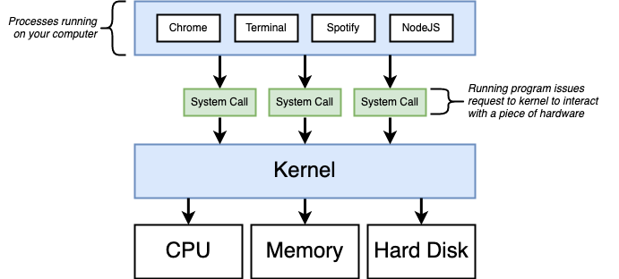

# Udemy Docker Course

## Chapter1 Dive Into Docker!

#### What is docker

In tradition installation software is to 

- Download installer
- run installer
- Get an error during installation
- Troubleshoot issue 
- Rerun installer and get others error. 

That's the problem that docker is going to solve, we use docker to make an easy to install and run software without worrying about setup or dependecies.

#### Docker Ecosystem


#### Image

> Single file with all dependencies and config required to run a software

#### Container

> Instance of an image. Runs a program

#### Docker for Windows/Mac

- Docker Client (Docker CLI) -> Tool that we are going to issue commands to
- Docker Server (Docker Daemon) -> Tool that responsible for creating images, running containers, etc.

#### Steps of using Docker

- Sign up for a Docker Hub account (docker.com)
- Download/Install Docker for Mac
- Login to Docker
- Verify Docker installation

#### Example of docker command

```dockerfile
docker run hello-world
```

- When we run this command in computer by using **Docker Client** after that the command will go to **Docker Server** and check the image (hello-world) in Image Cache in our computer, if there is no image in local computer, it will download image from the **Docker Hub**
- When we run on the second time, we will not see the message `Unable to find image locally` since this image is cached in the image cache on our computer.


#### Kernel



- kernel is a system that will receive system call from software and control the hardware to do the instructions. For example, Google Chrome create a system call that request to kernel to interact with a piece of hardware.


- In some situations, If chrome need **python v2** but NodeJS need **python v3**, when it makes system call to read HDD, kernel will determine that which process is making this system call. In Hard Disk, there are **two segments** which is python v2 and v3.


#### Namespacing


- Namespacing is **isolate resources** per process (or group of process). Such as, Processes, Hard drive, Network, Users, Hostnames, Inter Process Communications. 

#### Control Groups (cgroups)

- Control Groups is limitation of amount of resources used per process. Such as, Memory, CPU Usage, HD I/O, Network Bandwith.

- **For example**, when we creat a container and run a software inside it, it can access only resorces inside that container that we allow such as Hard Drive, Network, RAM, CPU (limited resources. When it broken, it broke only inside that container).

#### Image


- Compose of FS Snapshot Such as, Chrome, Python and Startup Command Such as Run Chrome
- In docker, the running process will go to Linus Kernel and goto Linux Virtial Machine -> MacOS/Windows -> Computer Hardware.

#### Docker on your computer


Since the concept of namespacing and control groups is a concept of linux. That means window and mac cannot make use of it. So, docker itself is a Linux virtual machine, when you run `docker version` you will see the OS is the linux. That means your containers communicate with linux kernel that will also communiate with linux VM that is hosted on your host OS (Mac/windows).