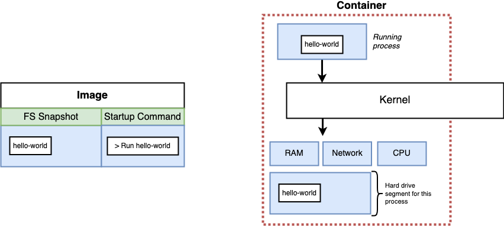

# Udemy Docker Course

## Chapter 2 Manipulating Containers with Docker Client

#### Create and run Containers from image

```dockerfile
docker run <image name>
```

- docker -> Reference the Docker Client
- run -> Try to create and run a container
- image name -> Name of image to use for this container

```dockerfile
docker run hello-world
```

Image hello-world, the FS Snapshot is hello-world and startup command is "Run hello-world".




Rememner that when we run docker, we do not get only the file snapshot, we also get default run command. And we can override it.

```dockerfile
docker run <image name> <command>
```

- command -> default command override

```dockerfile
docker run busybox ls
```

> The default command was override to be **ls** (we don't know the default command) so it will list all directory in busybox snapshot which is bin, dev, etc, home, proc, root.

```dockerfile
docker run busybox echo hi there
```


***Note:** we can only run the command that is exist on that container. The reasons that we can run `ls` command on busybox is that on that FS snapshot it has the `ls` executable command. But not for `hello-world` container that contains only one single file that print some message the console.

---

#### List all running containers

```dockerfile
docker ps
docker ps --all
```

- **ps** is to list all runing containers
- **-all** is to list all containers (create + start + shutdown)

```dockerfile
docker run => docker create + docker start
```

---

#### Create a container

> Setting up the FS Snapshot inside the container. After we create container, we will get the id of the container

```dockerfile
docker create <image name>
docker create hello-world
```

---

#### Start a Container

> Actually start the container (run the command)

```dockerfile
docker start <container id>
docker create hello-world
docker start 7bc37f3d74bd733918377
docker start -a 7bc37f3d74bd733918377
```

> We use attribute -a to tell that we want to see the output after we start the container and container is stopped, if we did not use -a, the containers just run but we did not see any output of them.

---

#### Example of busybox Image (override command)

```dockerfile
docker run busybox echo hi there
docker run busybox ping google.com
```

> If we try to override the default comand of hello-world image such as echo, ping. It will get an error because FS Snapshot of hello-world has only hello-world so we cannot use other command (this image did not provide other commands)

---

#### Docker Life Cycle

-> After we create and start a container, please note that the container is just stop (Exited) but the container is not killed yet. That means we can run the container again

```dockerfile
docker run busybox echo hello-busybox
docker start -a 7bc37f3d74bd733918377
docker start -a 7bc37f3d74bd733918377 echo hi there //we cannot do like this
```

> Also please note that after we create a container, when we run a container, we cannot override the command.

---

#### System prune

```dockerfile
docker system prune
```

In this command, it will deleted all of these

- all stopped containers
- all networks not used by at least one container
- all dangling umages
- all build cache

-> That means we have to wait a few second when we download an image from docker hub.

---

#### Get logs from a container

```dockerfile
docker logs <container id>
docker create busybox echo hi there
docker start 7bc37f3d74bd733918377
docker logs 7bc37f3d74bd733918377
```

-> after we start the container (running process is running in the background), we can see all output from that containers (we did not run container, we just see the logs).

---

#### Stop a container

-> stop command will call **SIGTERM** Message (shutdown the container and give some times to ccontainer to do something that it did not finish yet or things that it has to do after it was shutdown such as emit message). If the container did not shutdown within 10 seconds, docker will call kill command automatically.

```dockerfile
docker stop <container id>
docker stop 7bc37f3d74bd733918377
```

#### Kill a container

-> Kill command will cal **SIGKILL** that will kill the container **right now!**

```dockerfile
docker kill <container id>
docker kill 7bc37f3d74bd733918377
```

---

#### Redis

```dockerfile
docker run redis
```

-> We use redis cli to interact with Redis Server. When we run the redis container and we would like to do something inside that container, we cannot do it directly in our computer bacause it's not inside the redis container. That's why we have to do somethings to type the command inside that container.

---

#### Execute an additional command in a container

```dockerfile
docker exec -it <container id> <command>
```

- **exec** -> Run another command
- **-it** -> Allow us to provide input to the container
- **command** -> Command to execute

```dockerfile
docker run redis
docker exec -it 2a831abcb38c redis-cli
set myvalue 5
get myvalue //5
```

From this example, we run the redis container and we execute another command inside that container by specify the <container id>. Please note that if we did not use **-it** we cannot type any inputs and also cannot see any outputs from this container. (we was quit from that container automatically).

---

#### The purpose of IT Flag

-> The command that we run inside the container has three channels that communicate with our terminal

- STDIN -> Standard Input
- STDOUT -> Standard Output
- STDERR -> Standard Error

-> **-i** flag is to specify that we wan to allow to input the command inside that container, for **-t** flag is just for nice output in the terminal (without -t we can still input the command)

```dockerfile
docker exec -it 2a831abcb38c redis-cli
docker exec -i -t 2a831abcb38c redis-cli //same as above command, just seperate the flag
docker exec -i 2a831abcb38c //we can still input, but output is not nicely
```

---

#### Getting a command prompt in a container

-> Since using **docker exec** command everytime that we would like to excecute command is a waste of time, so we can get a command by using command **sh**

```dockerfile
docker exec -it 2a831abcb38c sh //we get command prompt in a container
cd /
ls
redis-cli //run redis-cli inside the container
```

---

#### Command Processors

-> Program that allow us to execute command.

- bash
- powershell
- zsh
- sh

```dockerfile
docker run -it busybox sh
```

---

#### Docker Isolation

-> Please note that when we run two containers, these two containers are separate completely, so the file system did not shared to each other.

```dockerfile
docker run -it busybox
docker run -it busybox
//these two containers are separate
```

---


